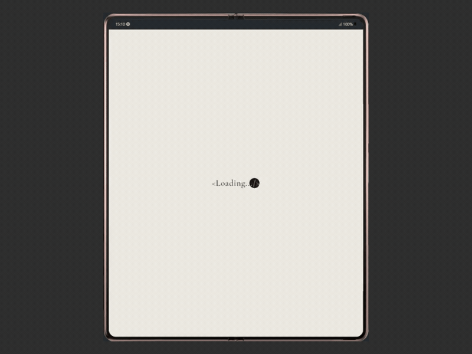

 
  <h1>Portfolio</h1>

 
  
   
  
  
  
  
  
  
  
  
  
  
  
  

This project showcases my web development projects, highlights my skills, and provides contact information for potential collaborations or opportunities.

## About the Project

I developed this portfolio to have a platform where I can showcase the projects I've worked on, share a bit about myself, and make my CV accessible to anyone interested. My goal was to create a modern, responsive website with smooth animations and user-friendly navigation.

## Key Features

- **Home Page:** A brief introduction and a call to action.
- **About Page:** Learn more about my background, skills, and achievements.
- **Projects Page:** A collection of my recent web development projects with links to live demos and source code.
- **Contact Page:** An easy-to-use form for getting in touch with me.
- **Responsive Design:** Optimized for viewing on various devices.
- **Dark Mode Toggle:** Switch between light and dark themes based on user preference.

## Screenshots

  

## Additional Information

- Developed by Evelin Alvarado.
- Find me on [GitHub](https://github.com/EvelinAlvarado) and [LinkedIn](https://www.linkedin.com/in/evelinalvarado/).

Check out the live project: [Portfolio Evelin Alvarado](https://github.com/EvelinAlvarado/portfolio)
